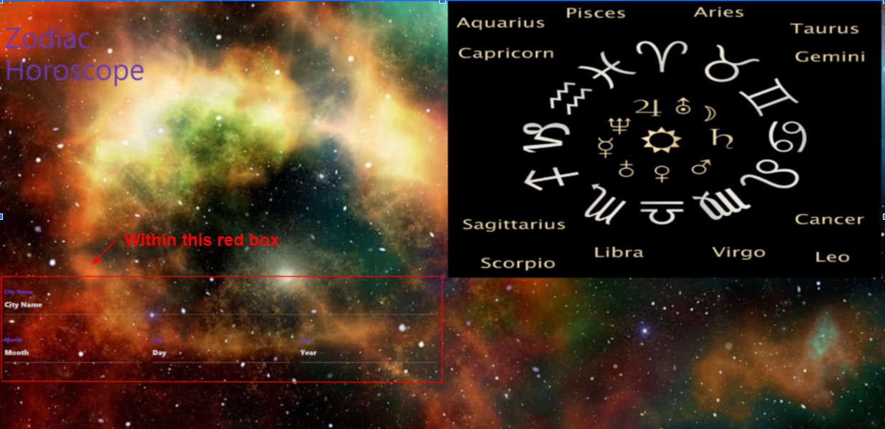

# Daily Horoscope

## Description
This app allows the user to input their zodiac information (Date of birth (Month/Day/Year), Location of birth) to retrieve a personalized forecast of their life using the Aztro Astrology api. Choosing the right api for our project led to some initial difficulties, however our team is confident in its choice.  The Aztro api is an excellent starting point, due to its ease of access and lack of node.js requirements. In later updates, there are plans for implementations of additional api for more horoscope insights. The Daily Horoscope app also tracks your search parameters into the local storage for ease of access; for navigating back to your prior search.

## How to use the APP
The app starts on a form page where you put your relevant information about your zodiac within the form (marked here with a red box) 

## Future features
* Dynamic Background
* More forecasts per day

## Credits
Apis used in the app

[Aztro](https://aztro.readthedocs.io/en/latest/)

[Geocoding Api](https://openweathermap.org/api/geocoding-api)

Contributors and their respective github profiles

 Bridegette Quiambao
[GitHub](https://github.com/bridgettequiambao)

Kalani Mojica
[GitHub](https://github.com/mojikalani)

Mitchell Riley
[GitHub](http://github.com/pherenzia)

